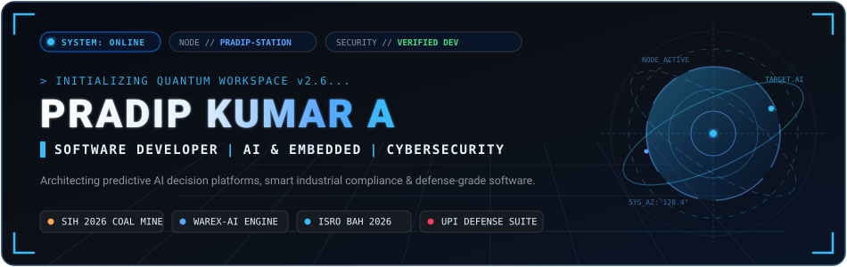
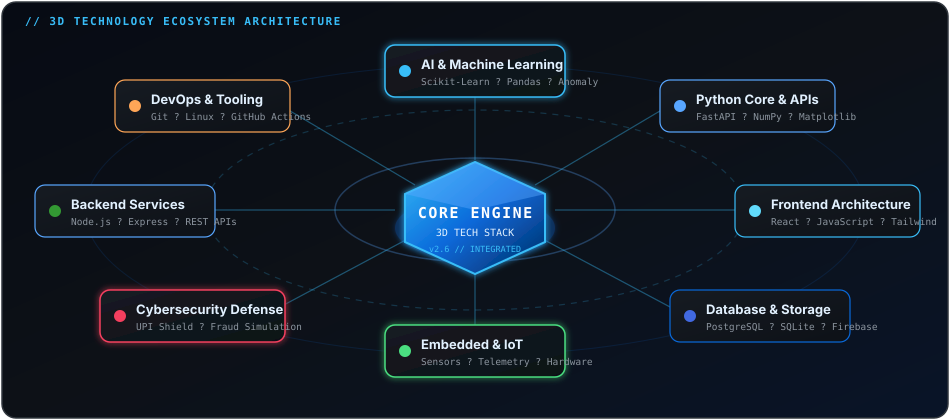
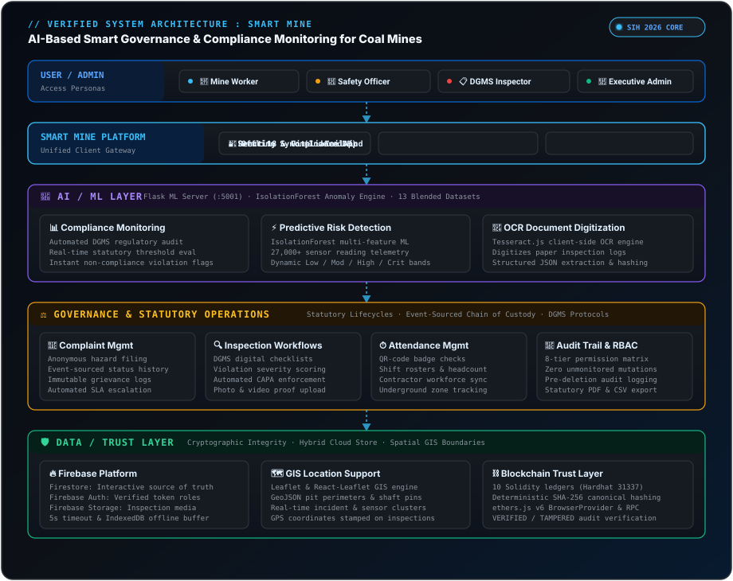

<div align="center">

  <!-- ======================================================= -->
  <!-- 1. HOLOGRAPHIC COMMAND CENTER HERO HEADER               -->
  <!-- ======================================================= -->
  

  <br/><br/>

  <!-- Dynamic Typing Sub-Header -->
  <a href="https://github.com/btechece241829-del">
    
  </a>

  <!-- Top Badges & Quick Links -->
  <p>
    
    <a href="https://github.com/btechece241829-del?tab=repositories">
      
    </a>
    <a href="https://www.linkedin.com/in/pradipkumar-a-expert" target="_blank">
      
    </a>
    <a href="https://www.instagram.com/_pradip_.04" target="_blank">
      
    </a>
  </p>

</div>


<!-- ======================================================= -->
<!-- 2. DEVELOPER IDENTITY HUD                                -->
<!-- ======================================================= -->
<div align="center">
<table width="100%">
  <tr>
    <td align="center">
      <pre>
┌──────────────────────────────────────────────────────────────────────────┐
│  DEVELOPER PROFILE :: PRADIP KUMAR                                       │
│                                                                          │
│  SOFTWARE DEVELOPER &amp; SYSTEMS ARCHITECT                                  │
│  AI • EMBEDDED SYSTEMS • CYBERSECURITY                                   │
│                                                                          │
│  Building real-world technology solving high-consequence problems.       │
└──────────────────────────────────────────────────────────────────────────┘
      </pre>
    </td>
  </tr>
</table>
</div>

<!-- ======================================================= -->
<!-- 3. ABOUT ME & BACKGROUND                                -->
<!-- ======================================================= -->
### 👦🏻💻 About Me

<table>
  <tr>
    <td width="64%" valign="top">

- 🏛️ **Identity**: Software Developer with an Electronics &amp; Communication Engineering (ECE) foundation based in **Pondicherry, India**.
- ⚙️ **What I Build**: Production-grade AI platforms, predictive analytics pipelines, IoT telemetry systems, and defensive cybersecurity tools.
- 🎯 **Problem Space**: Complex real-world domains — coal mine statutory governance, automated warehouse demand forecasting, and financial fraud telemetry.
- 🔬 **Current Research**: Edge AI anomaly detection, real-time spatial streaming with GIS, and tamper-evident cryptographic audit logs.
- 🚀 **Career Direction**: Engineering resilient, scalable software architectures bridging intelligent machine learning models with physical world infrastructure.

    </td>
    <td width="36%" valign="top">

```yaml
profile:
  name: PRADIP KUMAR
  role: Software Developer
  location: Pondicherry, India
  education: B.Tech ECE
  specialization:
    - AI & ML Systems
    - Embedded & IoT
    - Cybersecurity Research
  status: Actively Building
```

    </td>
  </tr>
</table>


<!-- ======================================================= -->
<!-- 4. SYSTEM STATUS / CURRENT FOCUS                        -->
<!-- ======================================================= -->
### ⚡ System Status & Current Focus

<div align="center">
<table>
  <thead>
    <tr>
      <th align="left">SUBSYSTEM</th>
      <th align="center">STATUS</th>
      <th align="left">ACTIVE INITIATIVES &amp; FOCUS AREAS</th>
    </tr>
  </thead>
  <tbody>
    <tr>
      <td><b>Software Development</b></td>
      <td align="center"></td>
      <td>Full-stack architectures, high-performance REST APIs, state management</td>
    </tr>
    <tr>
      <td><b>AI / ML Engineering</b></td>
      <td align="center"></td>
      <td>Explainable risk scoring, demand forecasting, multi-factor anomaly detection</td>
    </tr>
    <tr>
      <td><b>Embedded &amp; IoT</b></td>
      <td align="center"></td>
      <td>Sensor telemetry ingestion (gas/dust/vibration), edge compute, microcontrollers</td>
    </tr>
    <tr>
      <td><b>Cybersecurity Research</b></td>
      <td align="center"></td>
      <td>Defensive security simulation, OTP vulnerability defense, identity protocols</td>
    </tr>
    <tr>
      <td><b>Hackathons &amp; Innovation</b></td>
      <td align="center"></td>
      <td>Smart India Hackathon (SIH 2026), ISRO BAH 2026, 24-Hour AI sprints</td>
    </tr>
    <tr>
      <td><b>Open Source</b></td>
      <td align="center"></td>
      <td>Community tooling, reproducible ML notebooks, defensive educational suites</td>
    </tr>
  </tbody>
</table>
</div>

<br/>

<!-- ======================================================= -->
<!-- 5. 3D TECH STACK VISUALIZATION                          -->
<!-- ======================================================= -->
### 🌐 3D Technology Ecosystem

<div align="center">
  
</div>

<br/>

<!-- ======================================================= -->
<!-- 6. TECH STACK SPECIFICATIONS                            -->
<!-- ======================================================= -->
### 🛠️ Technical Arsenal

<table width="100%">
  <tr>
    <td width="22%"><b>Languages</b></td>
    <td>
      
      
      
      
      
    </td>
  </tr>
  <tr>
    <td><b>AI &amp; Data Science</b></td>
    <td>
      
      
      
      
      
    </td>
  </tr>
  <tr>
    <td><b>Frontend &amp; UI</b></td>
    <td>
      
      
      
      
    </td>
  </tr>
  <tr>
    <td><b>Backend &amp; APIs</b></td>
    <td>
      
      
      
      
    </td>
  </tr>
  <tr>
    <td><b>Databases &amp; Cloud</b></td>
    <td>
      
      
      
    </td>
  </tr>
  <tr>
    <td><b>Embedded &amp; IoT</b></td>
    <td>
      
      
      
    </td>
  </tr>
  <tr>
    <td><b>Cybersecurity &amp; Tools</b></td>
    <td>
      
      
      
      
      
    </td>
  </tr>
</table>


<!-- ======================================================= -->
<!-- 7. FLAGSHIP PROJECT: MINEGOV AI (SMART MINE)            -->
<!-- ======================================================= -->
### ⛏️ Flagship Project: MineGov AI — Smart Coal Mine Governance

> **AI-Based Smart Governance &amp; Compliance Monitoring System for Coal Mines**  
> *Architected for Smart India Hackathon (SIH 2026)*

<div align="center">
  
</div>

<br/>

<table>
  <tr>
    <td width="50%" valign="top">

#### 🎯 Core Capabilities
- **13 Unified Datasets**: Cross-domain relational model joining mines, inspections, violations, CAPA, equipment, and workforce.
- **Explainable Multi-Domain Risk Engine**: Generates dynamic risk scores across Safety (30%), Compliance (22%), Environment (15%), Equipment (12%), Contractor (11%), and Operations (10%).
- **27,000+ IoT Sensor Anomaly Engine**: Continuous time-series evaluation for methane, dust, vibration, and environmental threshold exceedances.
- **Automated CAPA Workflow**: Closed-loop tracking from inspection detection ➔ violation ➔ assignment ➔ proof verification ➔ verified closure.

    </td>
    <td width="50%" valign="top">

#### 🛡️ Trust &amp; Enterprise Architecture
- **Blockchain-Backed Audit Trail**: Tamper-proof logging of compliance status modifications and verified inspection records.
- **OCR Document Digitization**: Automated extraction and validity tracking for statutory mine certificates and licenses.
- **MapLibre GIS Command Center**: Geo-spatial visualization of mine clusters, hazard hotspots, and field inspection locations.
- **Role-Based Access Control**: 8 customized operational views (Corporate Management, Mine Manager, Safety Officer, DGMS Auditor).

    </td>
  </tr>
</table>

<div align="center">
  <a href="https://github.com/btechece241829-del">
    
  </a>
</div>

<br/>

<!-- ======================================================= -->
<!-- 8. FEATURED ENGINEERING PROJECTS                        -->
<!-- ======================================================= -->
### 🚀 Featured Engineering Projects

<table>
  <tr>
    <td width="33%" valign="top">

### 🏢 WAREX-AI / IntellStock
*AI-Powered Predictive Warehouse Operations &amp; Decision Platform*

**Technology Stack:**  
`Python` `FastAPI` `Scikit-Learn` `Pandas` `React` `Groq API`

**Key Highlights:**
- **Continuous Intelligence Loop**: Converts operational orders into ML features for proactive decisions.
- **Predictive Demand &amp; Stockout**: Forecasts inventory velocity and seasonal spikes to preempt supply bottlenecks.
- **Explainable Smart Reorders**: Automatically calculates optimal order quantities balancing cost and holding risk.
- **AI Decision Copilot**: LLM assistant backed by verified database queries with human approval workflows.

<br/>
<a href="https://github.com/btechece241829-del/WAREX-AI">
  
</a>

    </td>
    <td width="33%" valign="top">

### 🛡️ UPI-fraudection
*Cybersecurity Threat Research &amp; Phishing Simulation Toolkit*

**Technology Stack:**  
`Python` `Security Protocols` `Threat Modeling` `Linux`

**Key Highlights:**
- **Defensive Threat Emulation**: Simulates deceptive authentication vectors and OTP interception flows for security audits.
- **Vulnerability Analysis**: Evaluates friction lapses and behavioral vulnerabilities in authentication loops.
- **Security Education**: Provides reproducible educational demonstrations to help institutions train against social engineering attacks.
- **Privacy First**: Built strictly for authorized research and hardening defensive payment authentication protocols.

<br/>
<a href="https://github.com/btechece241829-del/UPI-fraudection">
  
</a>

    </td>
    <td width="33%" valign="top">

### 🎯 smart-seg
*RFM-Based K-Means Customer Segmentation Engine*

**Technology Stack:**  
`Python` `Scikit-Learn` `Pandas` `NumPy` `Matplotlib`

**Key Highlights:**
- **RFM Feature Engineering**: Computes Recency, Frequency, and Monetary scores across transactional customer records.
- **Unsupervised Clustering**: Applies optimal K-Means with Elbow and Silhouette optimization to isolate behavior groups.
- **CLV Optimization**: Identifies high-value enterprise patrons, churn risks, and dormant customer cohorts.
- **Analytical Reporting**: Generates interactive visualization plots for data-driven strategic marketing.

<br/>
<a href="https://github.com/btechece241829-del/smart-seg">
  
</a>

    </td>
  </tr>
</table>


<!-- ======================================================= -->
<!-- 9. HACKATHON & INNOVATION MILESTONES                    -->
<!-- ======================================================= -->
### 🏆 Hackathon &amp; Innovation Milestones

<div align="center">
<table>
  <tr>
    <td width="33%" align="center">
      <h4>🏆 Smart India Hackathon (SIH 2026)</h4>
      <p><b>Domain:</b> Mining Safety &amp; Statutory Governance</p>
      <p style="font-size: 13px; color: #8b949e;">Architected MineGov AI — end-to-end multi-mine risk prediction, sensor anomaly detection, and blockchain compliance audit platform.</p>
    </td>
    <td width="33%" align="center">
      <h4>🚀 ISRO BAH 2026</h4>
      <p><b>Domain:</b> Space &amp; Geospatial Technology</p>
      <p style="font-size: 13px; color: #8b949e;">Bharatiya Antariksh Hackathon initiative exploring satellite telemetry, spatial mapping, and remote observation intelligence.</p>
    </td>
    <td width="33%" align="center">
      <h4>⚡ 24-Hour AI Hackathon Sprint</h4>
      <p><b>Domain:</b> Predictive Logistics &amp; Operations</p>
      <p style="font-size: 13px; color: #8b949e;">Conceived, trained, and deployed WAREX-AI — predictive inventory machine learning platform with human-in-the-loop decision copilot.</p>
    </td>
  </tr>
</table>
</div>

<br/>

<!-- ======================================================= -->
<!-- 10. GITHUB METRICS & ANALYTICS                          -->
<!-- ======================================================= -->
### 📊 Performance Metrics &amp; Activity

<div align="center">
  
</div>

<br/>

<div align="center">
  
</div>

<div align="center">
  
  
  
  
</div>

<br/>

<!-- ======================================================= -->
<!-- 11. 3D CONTRIBUTION MATRIX                              -->
<!-- ======================================================= -->
### 🐍 The Contribution Matrix

*Eating its way through my GitHub contributions — refreshed automatically via GitHub Actions.*

<picture>
  <source media="(prefers-color-scheme: dark)" srcset="https://raw.githubusercontent.com/btechece241829-del/btechece241829-del/output/github-contribution-grid-snake-dark.svg">
  <source media="(prefers-color-scheme: light)" srcset="https://raw.githubusercontent.com/btechece241829-del/btechece241829-del/output/github-contribution-grid-snake.svg">
  
</picture>


<!-- ======================================================= -->
<!-- 12. DEVELOPER JOURNEY TIMELINE                          -->
<!-- ======================================================= -->
### 🧭 Engineering Journey

```text
2024  ├── [FOUNDATION]   B.Tech ECE Inception • Embedded Hardware • C/C++ • Core Algorithms
      │
2025  ├── [EXPANSION]    Full-Stack Web Systems • Python Analytics • PostgreSQL • API Architecture
      │
2026  ├── [ACCELERATION] Smart India Hackathon (SIH 2026) • ISRO BAH • WAREX-AI Platform
      │                  UPI Security Simulation • Advanced Anomaly Detection Models
      │
NOW   └── [FRONTIER]     Production AI Systems • Edge IoT Telemetry • Distributed Trust Architectures
```

<br/>

<!-- ======================================================= -->
<!-- 13. HOLOGRAPHIC TERMINAL HUD                            -->
<!-- ======================================================= -->
### 💻 Holographic Terminal

```bash
pradip@developer-station:~$ whoami
Pradip Kumar — Software Developer & AI Systems Architect (Pondicherry, India)

pradip@developer-station:~$ fetch --system-profile
┌───────────────────────┬────────────────────────────────────────────────────────┐
│ PRIMARY STACK         │ Python, FastAPI, React, TypeScript, PostgreSQL, Scikit │
│ EMBEDDED & IoT        │ Microcontrollers, Gas/Dust Telemetry, Edge Computing   │
│ RESEARCH DOMAINS      │ Anomaly Detection, Explainable Risk, Threat Simulation │
│ ACTIVE MILESTONES     │ SIH 2026 (MineGov AI) • ISRO BAH 2026 • WAREX-AI       │
│ RUNTIME DIRECTIVE     │ "Transforming high-dimensional data into robust code"  │
└───────────────────────┴────────────────────────────────────────────────────────┘

pradip@developer-station:~$ status --network
STATUS: READY TO COLLABORATE // OPEN TO HIGH-IMPACT OPPORTUNITIES
```


<!-- ======================================================= -->
<!-- 14. CONNECT WITH ME                                     -->
<!-- ======================================================= -->
### 🌐 Connect & Collaborate

<div align="center">
  <p><em>Interested in collaborating on AI engineering, embedded systems, or security research? Let's connect.</em></p>
  
  <a href="https://www.linkedin.com/in/pradipkumar-a-expert" target="_blank">
    
  </a>
  &nbsp;
  <a href="https://www.instagram.com/_pradip_.04" target="_blank">
    
  </a>
  &nbsp;
  <a href="https://github.com/btechece241829-del">
    
  </a>
  &nbsp;
  <a href="https://github.com/btechece241829-del?tab=repositories">
    
  </a>
</div>

<br/>

<div align="center">
  <sub>Designed with precision for GitHub • Engineered by <b>PRADIP KUMAR</b></sub>
</div>
